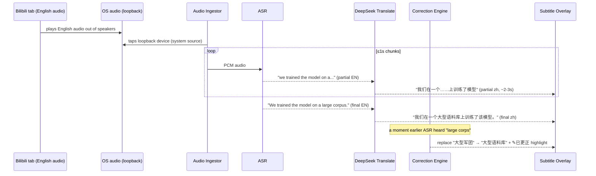
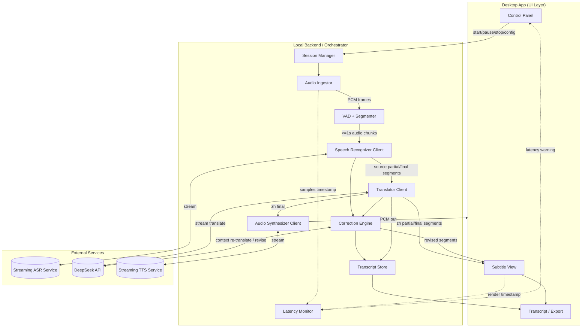
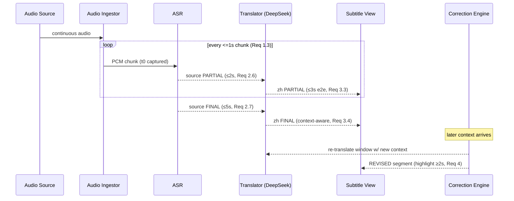
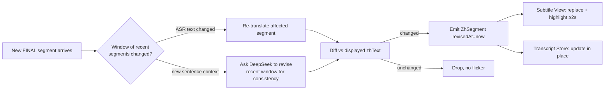
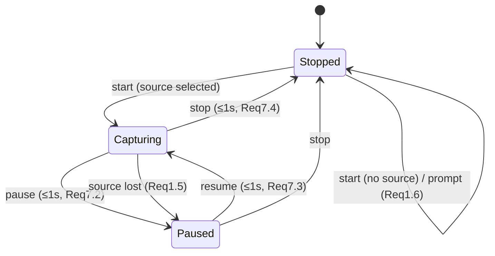

# Design Document

## Overview

The AI Simultaneous Interpretation Assistant captures a one-way source-language audio stream, transcribes it, translates it into fluent Chinese in real time, and presents the result as live subtitles and optional synthesized Chinese speech. A continuous self-correction loop revises earlier output as more context arrives.

A central design fact drives the whole architecture: **the DeepSeek API is a text-only LLM.** It has no native speech-to-text or text-to-speech. DeepSeek is therefore used for the two tasks it excels at and that this product most depends on — **streaming translation** and the **self-correction engine** — while dedicated streaming ASR and TTS services sit on either side of it. DeepSeek's OpenAI-compatible streaming interface and large (1M-token) context window make it well suited to incremental translation and to reasoning over the accumulated session transcript when correcting earlier segments.

This document specifies the product form, the runtime architecture, the streaming pipeline, the correction algorithm, the DeepSeek integration, data models, error handling, the UI design, and the testing strategy. It satisfies the nine requirements in `requirements.md`.

### Goals

- End-to-end latency of ≤3 s for partial Chinese subtitles (Req 3.3, 9.1).
- Fluent, context-aware Chinese translation via DeepSeek (Req 3).
- Automatic, visible self-correction of recent segments (Req 4).
- Subtitle and optional Chinese-audio output (Req 5, 6).
- Robust session control, transcript retention, and export (Req 7, 8).
- Stable operation across 120-minute sessions (Req 9).

### Non-Goals

- Two-way / conversational interpretation (the stream is one-way).
- Speaker diarization or multi-speaker labeling.
- Offline, fully on-device operation (cloud ASR/LLM/TTS are assumed; on-device ASR is a documented fallback option only).

## Product Form

Three product forms were considered against the core need — interpreting audio the user is *listening to* (talks, conferences, online courses), which usually means capturing **system playback audio**, not just a microphone.

| Form | System-audio capture | Reach | Effort | Fit |
|------|---------------------|-------|--------|-----|
| Web app (browser tab) | Limited — only `getDisplayMedia` tab/share audio, OS-dependent | High | Low | Partial |
| Browser extension | Tab audio via `tabCapture`; no OS-wide audio | Medium | Medium | Partial |
| **Desktop app (recommended)** | Full — system loopback, mic, and files | Medium | Medium-High | **Best** |

**Decision: a cross-platform desktop application.** Only a desktop app can reliably capture system playback audio (the loopback / "what you hear" device) across the scenarios in the requirements, while also handling microphone and local media files (Req 1.1). The recommended stack is **Tauri (Rust core + web UI)** or **Electron** if the team is more comfortable with a pure Node/web stack. The UI is built with web technologies (React + TypeScript) so the same subtitle-rendering code could later be reused in a web build.

A lightweight **web demo** (mic + tab audio via `getDisplayMedia`) is recommended as a secondary deliverable for the training-camp showcase, since it is easy to run and share. The pipeline below is transport-agnostic, so both forms share the same backend.

### Recommended Technology Stack

| Layer | Choice | Rationale |
|-------|--------|-----------|
| Desktop shell | Tauri (or Electron) | System audio capture, small footprint, web UI |
| UI | React + TypeScript | Fast subtitle rendering, reusable on web |
| Audio capture | OS loopback (WASAPI / CoreAudio / PulseAudio) + WebAudio for mic | Covers all three audio sources |
| Streaming ASR | Cloud streaming ASR (e.g. a vendor offering partial/final hypotheses) with on-device Whisper-class model as fallback | DeepSeek has no ASR; needs incremental partials |
| Translation + Correction | **DeepSeek API** (`deepseek-v4-flash` for streaming, `deepseek-v4-pro`/`deepseek-reasoner` for correction reasoning) | Text-only LLM; fluent zh translation; 1M context; streaming; low cost |
| TTS | Cloud streaming TTS with Chinese voices | DeepSeek has no TTS |
| Backend orchestrator | Local service inside the desktop app (Rust/Node), or a thin cloud relay | Holds API keys, manages the pipeline |

> Security note: API keys for DeepSeek/ASR/TTS must never be embedded in the shipped client. They live in the local backend process (desktop) or a server-side relay (web demo). This is called out again in Error Handling and Security.

## Example Scenario: Watching an English Video on Bilibili

This walkthrough grounds the architecture in the most common real use case: the user is in a browser watching an English talk on a streaming site (e.g., Bilibili) and wants live Chinese subtitles.

### How audio is obtained

The assistant does **not** integrate with Bilibili and needs no plugin or access to the video. The site plays English audio out of the user's speakers, and the app captures that same **system playback (loopback) audio**. To the website this is invisible — it is just normal playback. The instant the user presses play, the assistant hears exactly what the user hears.



### Step by step

1. The user launches the desktop app alongside the browser and selects **音频来源: 系统声音 (扬声器)** and **源语言: English** (Req 1.1, 2.4).
2. The user presses play on the Bilibili video and clicks start in the app (Req 1.2, 7.1).
3. The Audio Ingestor taps the OS loopback device; English audio flows through VAD → ASR → DeepSeek translation, and Chinese subtitles stream in roughly 2-3 seconds behind the speech (Req 3.3).
4. The user can keep the Subtitle View as a floating bar near the video or read it in the app window (Req 5).
5. Optionally the user enables **中文语音**; the app speaks the Chinese translation and ducks the English source audio so the two do not overlap (Req 6.2, 6.6).

### Self-correction in this scenario

Live ASR commits early. If the speaker says "a large **corpus**," the ASR may briefly emit "large **corps**," and DeepSeek translates it as "大型军团". When the full phrase is recognized, the Correction Engine re-translates that segment, detects the text changed, and replaces the subtitle with "大型语料库" plus a brief "✎已更正" highlight (Req 4). The user watches the early mistake quietly fix itself.

### Capture method trade-off for the browser case

| Method | Coverage for the Bilibili case | Notes |
|--------|-------------------------------|-------|
| **Desktop app (recommended)** | Captures all system sound regardless of which browser/app plays it | Most reliable; the textbook fit for this scenario |
| Web-demo version | Only "share this tab" audio via `getDisplayMedia` | Clunkier, OS-dependent; fine for a quick showcase |

This scenario is the primary reason the recommended product form is the desktop app.

> Privacy note: capturing system audio means the English audio is streamed to cloud ASR/DeepSeek/TTS services, so a consent step precedes the first session (see Security and Privacy). No Bilibili account or site data is touched — only the sound coming out of the speakers.

## Architecture

### High-Level Component Diagram



### Pipeline Stages and Latency Budget

The end-to-end budget targets ≤3 s for partial subtitles (Req 3.3, 9.1).



| Stage | Budget | Backing requirement |
|-------|--------|--------------------|
| Capture → ASR chunk | ≤1 s chunks | Req 1.3 |
| ASR partial | ≤2 s | Req 2.6 |
| ASR final | ≤5 s | Req 2.7 |
| Translate partial (display) | ≤3 s e2e | Req 3.3 |
| Correction emit + display | ≤2 s + ≤1 s | Req 4.1, 4.2 |
| TTS synth of final | ≤2 s | Req 6.2 |

## Components and Interfaces

### Audio Ingestor (Req 1)

Captures audio from the selected source and emits fixed-size PCM frames with capture timestamps (used by the Latency Monitor).

```typescript
type AudioSourceKind = 'system' | 'microphone' | 'file';

interface AudioSourceSelection {
  kind: AudioSourceKind;
  deviceId?: string;   // for system/microphone
  filePath?: string;   // for file
}

interface AudioFrame {
  sessionId: string;
  seq: number;            // monotonic, ordering guarantee (Req 9.4)
  capturedAt: number;     // epoch ms, t0 for latency
  pcm: Float32Array;      // mono, 16 kHz
  durationMs: number;     // ≤1000 (Req 1.3)
}

interface AudioIngestor {
  listSources(): Promise<AudioDeviceInfo[]>;          // Req 1.1
  start(sel: AudioSourceSelection): Promise<void>;    // ≤1s (Req 1.2)
  stop(): Promise<void>;                              // ≤1s (Req 1.4)
  onFrame(cb: (f: AudioFrame) => void): void;
  onSourceLost(cb: (reason: SourceLostReason) => void): void; // Req 1.5
  onFileEnd(cb: () => void): void;                    // Req 1.8
}
```

- Resamples to 16 kHz mono PCM (standard ASR input).
- System capture uses the OS loopback device; microphone uses the default/selected input; file uses a decoder that paces output to real time so latency math holds.
- `onSourceLost` fires for device disconnect, permission revoked, or unreadable file (Req 1.5); `start` rejects if the source is inaccessible at start (Req 1.7).

### VAD + Segmenter

A lightweight Voice Activity Detector gates the stream so the ASR only receives speech and so we can decide segment boundaries.

- Emits a segment-open event when speech of ≥200 ms continuous duration is detected (Req 2.2).
- Emits a segment-close event on a trailing silence threshold (~600 ms) or max segment length (~15 s), which is what flips an ASR partial into a final.

### Speech Recognizer Client (Req 2)

Wraps the streaming ASR service and normalizes its output into our `Segment` model.

```typescript
interface SourceSegment {
  id: string;            // stable id across partial->final
  sessionId: string;
  text: string;          // source language
  status: 'partial' | 'final';
  startedAt: number;     // capture time of first frame
  spokenIndex: number;   // chronological order key (Req 5.1, 8.1)
  recognizable: boolean; // false => unrecognized portion (Req 2.8)
}

interface SpeechRecognizer {
  setLanguage(lang: SupportedSourceLanguage): void;  // default 'en' (Req 2.3, 2.4)
  pushAudio(frame: AudioFrame): void;
  onSegment(cb: (s: SourceSegment) => void): void;   // partial ≤2s, final ≤5s
}
```

The ASR must support incremental hypotheses (partial results) so we can hit the 2 s partial target; not all engines do, which is why ASR selection is a named risk.

### Translator Client — DeepSeek (Req 3)

Translates each source segment into Chinese, preserving the partial/final classification (Req 3.2) and using sentence context for finals (Req 3.4). Uses DeepSeek streaming so Chinese characters appear as they are generated.

```typescript
interface ZhSegment {
  id: string;            // == SourceSegment.id
  sessionId: string;
  sourceText: string;
  zhText: string;
  status: 'partial' | 'final';
  spokenIndex: number;
  untranslated: boolean; // true => show source as fallback (Req 3.5)
  revisedAt?: number;    // set when corrected (Req 4)
}

interface Translator {
  translatePartial(seg: SourceSegment): AsyncIterable<string>; // streamed zh tokens
  translateFinal(seg: SourceSegment, context: ContextWindow): Promise<ZhSegment>;
}
```

DeepSeek call shape (OpenAI-compatible):

```jsonc
// POST https://api.deepseek.com/chat/completions
{
  "model": "deepseek-v4-flash",   // low-latency streaming workhorse
  "stream": true,
  "temperature": 0.3,             // favor stable, faithful translations
  "messages": [
    { "role": "system", "content": "You are a simultaneous interpreter. Translate the user's <source> text into fluent, natural Simplified Chinese. Preserve technical terms. Output ONLY the Chinese translation, no notes." },
    { "role": "user", "content": "<context>...preceding finalized sentences...</context>\n<source>...current segment...</source>" }
  ]
}
```

Design choices:
- **Model split:** `deepseek-v4-flash` for the hot streaming path (cheap, fast); `deepseek-v4-pro` / `deepseek-reasoner` reserved for correction passes where reasoning quality matters more than latency.
- **Context window:** the last N finalized sentence pairs (source + zh) are sent as `<context>` so pronouns/terminology stay consistent (Req 3.4). DeepSeek's 1M-token window comfortably holds a 120-minute transcript, but we cap context to a sliding window (~1–2 k tokens) for latency and cost.
- **Glossary injection:** an optional domain glossary (e.g., conference/technical terms) is prepended to the system prompt to improve fluency.
- **Fallback:** if a translation does not return within 3 s, the source text is shown and the segment marked `untranslated` (Req 3.5); a later correction pass can replace it.

### Correction Engine — DeepSeek (Req 4)

The differentiator. As later audio reveals that an earlier hypothesis was wrong (mis-recognized homophone, premature sentence boundary, wrong word sense), the engine re-evaluates a sliding window of recent segments and emits revised segments.



Correction scope and triggers:
- Eligible targets: segments displayed in the current session that are still `partial`, OR `final` segments displayed ≤10 s (Req 4.3). Finals older than 10 s are frozen (Req 4.5).
- Two trigger types:
  1. **ASR revision** — the ASR upgrades/changes a prior hypothesis (same segment id, new text). Re-translate that segment.
  2. **Context revision** — a newly finalized sentence changes the meaning of the immediately preceding window; DeepSeek is asked to re-translate the small window jointly for consistency.
- **Diffing to prevent flicker:** a revised translation is only emitted if it differs from what is displayed; otherwise it is dropped (avoids visual churn). Emit ≤2 s after the triggering audio (Req 4.1) and the view replaces text ≤1 s later with a ≥2 s highlight (Req 4.2, 4.4).

Correction prompt shape:

```jsonc
{
  "model": "deepseek-v4-pro",
  "messages": [
    { "role": "system", "content": "You are revising live interpretation subtitles. Given prior Chinese segments and newly clarified source context, return corrected Chinese for ONLY the segments whose meaning changed. Respond as JSON: [{\"id\":\"...\",\"zhText\":\"...\"}]. If nothing changed, return []." },
    { "role": "user", "content": "<window>...recent (id, sourceText, currentZh)...</window>\n<new_context>...latest finalized sentence...</new_context>" }
  ],
  "response_format": { "type": "json_object" }
}
```

### Audio Synthesizer Client (Req 6)

Synthesizes Chinese finals to speech when audio output is enabled (off by default, Req 6.1).

```typescript
interface AudioSynthesizer {
  setEnabled(on: boolean): void;     // disabling stops playback ≤1s (Req 6.5)
  setVolume(level: number): void;    // 0..10, 0 = mute (Req 6.4)
  enqueue(seg: ZhSegment): void;     // only finals, in spoken order (Req 6.2,6.3)
  onSynthFailure(cb: (id: string) => void): void; // skip + indicate (Req 6.7)
}
```

- A FIFO queue keyed by `spokenIndex` preserves order (Req 6.3).
- While Chinese TTS is playing, source audio is ducked/suppressed (Req 6.6) — for system/file sources the app lowers its own playback; for mic sources there is no source playback to suppress.
- Synthesis failures skip the segment and surface an indicator (Req 6.7).

### Session Manager (Req 7)

Owns the session state machine and fans control commands out to the pipeline.



- Exactly one of `capturing | paused | stopped` is exposed (Req 7.5).
- Invalid transitions (e.g., resume when not paused) are rejected, state retained, and the control marked unavailable (Req 7.6).

### Transcript Store (Req 8)

- Appends every Chinese final in spoken order (Req 8.1); updates entries in place when the Correction Engine revises them, preserving position (Req 8.2).
- Stores source text alongside Chinese when bilingual display is enabled (Req 8.4).
- Export to a text file is offered on stop when ≥1 final exists (Req 8.3); export failure surfaces an error and retains the transcript (Req 8.5); empty transcript shows a "nothing to export" state (Req 8.6).

### Latency Monitor (Req 9)

- Tracks `displayedAt - capturedAt` per partial; maintains a rolling p95 and the 5 s threshold.
- Raises the warning indicator within 2 s of breach (Req 9.2) and clears it after latency stays ≤5 s for ≥5 s (Req 9.3).
- The pipeline uses bounded back-pressure queues that never drop captured frames; under load it slows partial cadence rather than discarding audio (Req 9.4). If queues grow, partial frequency to DeepSeek is throttled while finals are preserved.

## Data Models

```typescript
interface Session {
  id: string;
  sourceLanguage: SupportedSourceLanguage; // default 'en'
  audioSource: AudioSourceSelection;
  state: 'capturing' | 'paused' | 'stopped';
  startedAt: number;
  settings: SessionSettings;
}

interface SessionSettings {
  showSourceText: boolean;     // default false (Req 5.2)
  fontSizeLevel: 1 | 2 | 3;    // ≥3 levels (Req 5.5)
  audioOutputEnabled: boolean; // default false (Req 6.1)
  volumeLevel: number;         // 0..10 (Req 6.4)
}

// ZhSegment / SourceSegment defined above are the transcript's units.
interface TranscriptEntry {
  spokenIndex: number;
  sourceText?: string;   // present when showSourceText was on (Req 8.4)
  zhText: string;
  status: 'final';
  revisedAt?: number;
}
```

Segment identity is the backbone: a single `id` flows source→translation→correction→transcript, so a correction updates exactly one entry everywhere it appears.

## UI Design

The layout is a single window optimized for *reading subtitles at a glance* — large, high-contrast Chinese text dominates; controls are secondary and collapse out of the way.

### Main Window (capturing, bilingual on)

```
┌──────────────────────────────────────────────────────────────────────┐
│  AI 同传助手            ● 正在收听   ⏱ 1.8s            ⚙ 设置  —  ☐  ✕ │ header / status (Req 7.5, 9.2)
├──────────────────────────────────────────────────────────────────────┤
│  来源: [🔊 系统声音 ▼]   语言: [English ▼]            ⟳ 延迟正常       │ source + lang (Req 1.1, 2.4)
├──────────────────────────────────────────────────────────────────────┤
│                                                                        │
│   ... earlier subtitles scroll up ...                          ▲       │
│                                                                │       │
│   EN  The model was trained on a large corpus.                 │       │ source line (Req 5.4)
│   中  该模型在一个大型语料库上完成训练。                          │       │ zh line (primary)
│                                                                │       │
│   EN  We then fine-tuned it for translation.                   ║       │ scrollbar (Req 5.7)
│   中  随后我们针对翻译任务对其进行了微调。                        ║       │
│                                                                │       │
│   EN  It reduces latency by about thirty percent.              │       │
│   中  它将延迟降低了约百分之三十。  ✎已更正                       ▼       │ corrected highlight ≥2s (Req 4.4)
│                                                                        │
│   中  现在我们来看实时演示……                  (partial, dimmed)        │ live partial (Req 3.3)
│                                                                        │
├──────────────────────────────────────────────────────────────────────┤
│  ▶/⏸ 暂停   ⏹ 停止     A− 字号 A+    🔈 中文语音 [○ off]  音量 ▢▢▢▢▢░  │ controls (Req 7.1,5.5,6.1,6.4)
└──────────────────────────────────────────────────────────────────────┘
```

Key UI behaviors:
- **Chinese is primary, source is secondary.** Source lines render smaller/lighter above each Chinese line and only when bilingual is on (Req 5.2–5.4). Chinese line uses the chosen font-size level (Req 5.5–5.6).
- **Live partial** appears dimmed/italic at the bottom and resolves into a solid final in place (Req 3.3); auto-scroll keeps the newest line in view (Req 5.1, 5.7).
- **Correction highlight:** a revised line briefly shows a colored background + "✎已更正" badge for ≥2 s, then settles to normal (Req 4.4).
- **Status cluster** (top-right): a live state dot (`正在收听 / 已暂停 / 已停止`, Req 7.5) and a latency readout that turns into a warning chip when >5 s (Req 9.2–9.3).
- **Untranslated fallback:** if translation fails, the source text shows in the Chinese slot with a subtle "未翻译" tag (Req 3.5); unrecognized audio shows a faint "（无法识别）" placeholder (Req 2.8).

### Settings Panel (slide-over)

```
┌───────────────────────────┐
│ 设置                    ✕ │
├───────────────────────────┤
│ 音频来源                  │
│  ○ 系统声音 (扬声器)       │ Req 1.1
│  ○ 麦克风                 │
│  ○ 媒体文件…  [选择文件]   │
│                           │
│ 源语言   [English ▼]      │ Req 2.4
│                           │
│ 显示                      │
│  [✓] 显示原文 (双语)       │ Req 5.2
│  字号  [ 小 | 中 | 大 ]    │ Req 5.5
│                           │
│ 中文语音输出              │
│  [ ○ ] 启用               │ Req 6.1 (off default)
│  音量  ▢▢▢▢▢▢░░░░          │ Req 6.4
│  语音  [女声 ▼]            │
│                           │
│ 模型 (DeepSeek)           │
│  翻译  [v4-flash ▼]       │
│  纠错  [v4-pro ▼]         │
│  术语表 [编辑…]           │
└───────────────────────────┘
```

### Stop / Export dialog (Req 8)

```
┌──────────────────────────────────┐
│ 本场会话已结束                    │
│ 共 142 条字幕，时长 27:14         │
│                                  │
│ [ 导出文本 (.txt) ]  [ 关闭 ]     │ Req 8.3 / disabled if empty (Req 8.6)
└──────────────────────────────────┘
```

The empty-transcript case replaces the export button with "无可导出的字幕"; an export failure shows an inline error and keeps the dialog open (Req 8.5).

### Visual & Accessibility Notes

- High-contrast default theme (light + dark), large default Chinese font, line spacing tuned for fast reading.
- The corrected-segment indicator does not rely on color alone — it pairs a background tint with the "✎已更正" text badge (accessibility).
- All controls are keyboard reachable; the subtitle area is an ARIA live region so screen readers announce new finals.
- Latency warning uses an icon + text, not color alone.

## Error Handling

| Condition | Handling | Requirement |
|-----------|----------|-------------|
| No source selected on start | Prompt to select; withhold capture | 1.6 |
| Source inaccessible at start | Error in Control Panel; withhold capture | 1.7 |
| Source lost mid-session | Error + auto-pause | 1.5 |
| File reaches end | Stop capture, retain subtitles | 1.8 |
| ASR cannot recognize audio | No segment; mark "（无法识别）" | 2.8 |
| Translation > 3 s / fails | Show source text, mark untranslated | 3.5 |
| DeepSeek rate-limit / 5xx | Exponential backoff + retry on flash; degrade to source passthrough; surface a transient banner | 3.5, 9 |
| Correction returns invalid JSON | Discard revision, keep current text | 4 (no regression) |
| TTS synth failure | Skip segment, continue, indicate failure | 6.7 |
| Export failure | Error message, retain transcript | 8.5 |
| Latency > 5 s | Warning indicator; throttle partial cadence, never drop audio | 9.2–9.4 |

Resilience principles:
- **Never drop captured audio** — bounded queues apply back-pressure; under sustained overload, partial-translation frequency is reduced but every frame is still processed for finals (Req 9.4).
- **Graceful degradation** — if DeepSeek is unavailable, the app keeps showing recognized source text so the user is never left blank.
- **Idempotent corrections** — revisions are keyed by segment `id` and diffed, so retries cannot duplicate or corrupt entries.

## Security and Privacy

- **API keys** for DeepSeek, ASR, and TTS reside only in the local backend process (desktop) or a server-side relay (web demo); they are never shipped in client JS or committed. Configuration is via environment variables / OS keychain.
- **Audio data** is streamed to third-party ASR/LLM/TTS services; this must be disclosed to the user, with an explicit consent step before the first session and a privacy note in settings. No audio or transcript is persisted beyond the session unless the user exports it.
- **Transport** to all external services is HTTPS/WSS only.
- Treat all external service responses as untrusted input (validate/parse correction JSON defensively).

## Correctness Properties

These invariants must hold regardless of input timing or load, and they anchor the property-based and soak tests below.

### Property 1: No audio loss and order preservation
Every frame captured by the Audio Ingestor is processed exactly once, in `seq` order; under load the system slows partial cadence but never discards a frame.
**Validates: Requirements 9.4**

### Property 2: Monotonic spoken order
Subtitles and transcript entries are always presented in non-decreasing `spokenIndex`; a correction never reorders entries.
**Validates: Requirements 5.1, 8.1, 8.2**

### Property 3: Segment identity stability
A segment's `id` is stable from source recognition through translation, correction, and transcript; any revision updates exactly the entries sharing that `id`.
**Validates: Requirements 4.2, 8.2**

### Property 4: Classification preservation
A Chinese segment's `partial`/`final` status always equals that of its source segment at translation time.
**Validates: Requirements 3.2**

### Property 5: Correction freeze rule
Once a `final` segment has been displayed for more than 10 s it is immutable; no later correction can alter it.
**Validates: Requirements 4.5**

### Property 6: Flicker-free revisions
A revised segment is emitted only if its text differs from what is currently displayed, preventing visual churn.
**Validates: Requirements 4.1, 4.2**

### Property 7: Output gating
No synthesized audio is produced while audio output is disabled, and disabling halts in-progress playback within 1 s.
**Validates: Requirements 6.1, 6.5**

### Property 8: Single session state
The exposed session state is always exactly one of `capturing | paused | stopped`; invalid transitions leave state unchanged.
**Validates: Requirements 7.5, 7.6**

### Property 9: No blank-screen degradation
If translation is unavailable, the user always sees source text rather than nothing.
**Validates: Requirements 3.5**

## Testing Strategy

### Unit Tests
- VAD/segmenter boundary logic: ≥200 ms speech opens a segment (Req 2.2); silence/length closes it.
- Translator classification preservation (partial↔final) (Req 3.2) and untranslated fallback path (Req 3.5).
- Correction diff/flicker suppression: identical re-translations are dropped; eligibility window (partial, or final ≤10 s) enforced (Req 4.3, 4.5).
- Session state machine: every valid/invalid transition (Req 7.1–7.6).
- Transcript update-in-place on correction preserves order (Req 8.2).
- TTS queue ordering and failure skip (Req 6.3, 6.7).

### Integration Tests
- Mocked ASR/DeepSeek/TTS drivers replay scripted partial→final→revision sequences; assert subtitle text, highlight timing, and transcript state.
- Latency Monitor: inject delays, assert warning raise ≤2 s and clear after ≥5 s recovery (Req 9.2, 9.3).
- Source-loss and file-end events drive correct state transitions (Req 1.5, 1.8).

### End-to-End / Performance Tests
- Golden audio clips (English talk samples) run through the real pipeline; measure p95 partial e2e latency ≤3 s (Req 3.3, 9.1).
- 120-minute soak test with a looped conference recording: assert sustained latency target, no dropped frames, stable memory (Req 9.1, 9.4).
- Correction accuracy: curated clips with known homophone/late-context errors; assert the displayed text converges to the correct translation.

### Manual / Acceptance
- Bilingual toggle, font-size levels, volume/mute, audio-output enable/disable across real system-audio, mic, and file sources.
- Accessibility pass: keyboard navigation, screen-reader announcement of new finals, color-independent correction indicator.

## Requirements Coverage Summary

| Requirement | Addressed by |
|-------------|--------------|
| 1 Audio capture & sources | Product Form, Audio Ingestor |
| 2 Source recognition | VAD/Segmenter, Speech Recognizer Client |
| 3 Real-time translation | Translator Client (DeepSeek streaming) |
| 4 Self-correction | Correction Engine (DeepSeek), Subtitle highlight |
| 5 Subtitle display | UI Design, Subtitle View |
| 6 Chinese audio output | Audio Synthesizer Client |
| 7 Session control | Session Manager state machine |
| 8 Transcript retention/export | Transcript Store, Stop/Export dialog |
| 9 Performance under load | Latency Monitor, back-pressure design |
