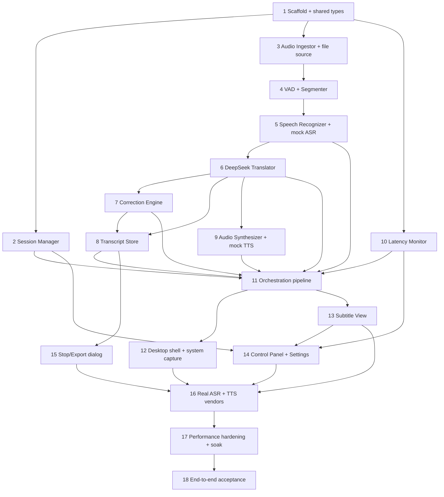

# Implementation Plan

## Overview

This plan builds the AI Simultaneous Interpretation Assistant incrementally: shared data models first, then each pipeline stage with mock external services, then the UI, then real ASR/DeepSeek/TTS integration, and finally performance hardening. DeepSeek powers translation and correction; ASR and TTS are pluggable services behind interfaces so the core can be built and tested against mocks before wiring real vendors.

Recommended stack (from design): Tauri or Electron desktop shell, React + TypeScript UI, local backend orchestrator (Node/TS). Tasks assume a TypeScript monorepo with a `core` package (pipeline) and an `app` package (UI/shell). Adjust paths if you choose a different layout.

## Tasks

- [ ] 1. Scaffold project and shared types
  - Initialize a TypeScript monorepo with `core` (pipeline/orchestrator) and `app` (desktop UI) packages, plus a test runner (Vitest) and lin/format config.
  - Define shared domain types in `core/src/models.ts`: `AudioSourceKind`, `AudioSourceSelection`, `AudioFrame`, `SourceSegment`, `ZhSegment`, `Session`, `SessionSettings`, `TranscriptEntry`, and the `SupportedSourceLanguage` union (default `en`).
  - Add a stable `id` / `spokenIndex` generation utility used across the pipeline.
  - _Requirements: 2.3, 3.2, 5.5, 6.1, 6.4_

- [ ] 2. Implement the Session Manager state machine
- [ ] 2.1 Build the session state machine
  - Implement `SessionManager` in `core/src/session/sessionManager.ts` with states `stopped | capturing | paused` and transitions start, pause, resume, stop.
  - Reject invalid transitions (e.g., resume when not paused), retain current state, and expose an "unavailable control" signal.
  - Expose exactly one current state at all times and emit state-change events.
  - _Requirements: 7.1, 7.2, 7.3, 7.4, 7.5, 7.6_
- [ ] 2.2 Write unit tests for all transitions
  - Cover every valid transition and representative invalid transitions; assert state retention and the unavailable-control signal.
  - _Requirements: 7.5, 7.6_

- [ ] 3. Implement the Audio Ingestor with a file/mock source
- [ ] 3.1 Define the AudioIngestor interface and a file-based source
  - Implement `AudioIngestor` in `core/src/audio/ingestor.ts` emitting `AudioFrame`s (mono 16 kHz, ≤1000 ms, monotonic `seq`, `capturedAt`).
  - Implement a file source that decodes a media file and paces frames to real time so latency math holds; emit an `onFileEnd` event at end of content.
  - Implement `listSources`, `start` (≤1 s), `stop` (≤1 s), `onFrame`, `onSourceLost`, `onFileEnd`.
  - _Requirements: 1.1, 1.2, 1.3, 1.4, 1.8_
- [ ] 3.2 Add start/error guards
  - Reject `start` when no source is selected (prompt signal) and when the selected source is inaccessible at start.
  - Emit `onSourceLost` with a reason for device disconnect, permission revoked, or unreadable file.
  - _Requirements: 1.5, 1.6, 1.7_
- [ ] 3.3 Write unit tests for framing, pacing, and error paths
  - Assert frame size/ordering, real-time pacing, file-end, and each error/guard path.
  - _Requirements: 1.3, 1.4, 1.5, 1.6, 1.7, 1.8_

- [ ] 4. Implement VAD + Segmenter
  - Implement a VAD/segmenter in `core/src/audio/segmenter.ts` that opens a segment after ≥200 ms continuous speech and closes it on ~600 ms trailing silence or a max length (~15 s).
  - Emit segment-open/segment-close events that downstream uses to flip partial→final.
  - Write unit tests with synthetic speech/silence frame sequences asserting boundary behavior.
  - _Requirements: 2.2_

- [ ] 5. Implement the Speech Recognizer client with a mock ASR
- [ ] 5.1 Define the SpeechRecognizer interface and mock driver
  - Implement `SpeechRecognizer` in `core/src/asr/recognizer.ts` producing `SourceSegment`s with stable `id` across partial→final, `status`, `startedAt`, `spokenIndex`, and `recognizable`.
  - Build a scripted mock ASR driver that replays partial→final (and revised-hypothesis) sequences for deterministic tests.
  - Support `setLanguage` (default `en`); enforce partial ≤2 s and final ≤5 s recognition latency in the mock's timing model.
  - _Requirements: 2.1, 2.3, 2.4, 2.5, 2.6, 2.7_
- [ ] 5.2 Handle unrecognized audio
  - When a portion cannot be recognized, emit no segment and surface an "unrecognized" marker while retaining prior segments.
  - _Requirements: 2.8_
- [ ] 5.3 Write unit tests for classification, latency, language, and unrecognized handling
  - _Requirements: 2.1, 2.5, 2.6, 2.7, 2.8_

- [ ] 6. Implement the DeepSeek Translator client
- [ ] 6.1 Build the DeepSeek client wrapper
  - Implement an OpenAI-compatible DeepSeek client in `core/src/llm/deepseekClient.ts` supporting streaming chat completions, configurable model id (`deepseek-v4-flash` default), temperature, API key from env/keychain (never hardcoded), and timeouts.
  - Add retry with exponential backoff for rate-limit/5xx responses.
  - _Requirements: 3.1, 3.5_
- [ ] 6.2 Implement the Translator
  - Implement `Translator` in `core/src/translate/translator.ts`: `translatePartial` (streamed zh tokens) and `translateFinal` (with a sliding `ContextWindow` of recent finalized source+zh pairs and optional glossary in the system prompt).
  - Preserve partial/final classification from the source segment onto the produced `ZhSegment`.
  - On translation timeout (>3 s) or failure, emit a `ZhSegment` flagged `untranslated` carrying the source text as fallback.
  - _Requirements: 3.1, 3.2, 3.3, 3.4, 3.5_
- [ ] 6.3 Write unit tests against a mock DeepSeek endpoint
  - Assert classification preservation, context inclusion, streaming assembly, and the untranslated fallback path; verify no API key is logged.
  - _Requirements: 3.2, 3.4, 3.5_

- [ ] 7. Implement the Correction Engine
- [ ] 7.1 Build correction triggers and eligibility window
  - Implement `CorrectionEngine` in `core/src/correct/correctionEngine.ts` tracking a sliding window of recent segments with display timestamps.
  - Eligibility: only segments in the current session that are `partial`, or `final` displayed ≤10 s; freeze finals displayed >10 s.
  - Implement two triggers: ASR-revision (same id, changed source text → re-translate) and context-revision (newly finalized sentence → re-translate the recent window jointly via DeepSeek `deepseek-v4-pro`, JSON response).
  - _Requirements: 4.1, 4.3, 4.5_
- [ ] 7.2 Implement diff/flicker suppression and emission
  - Compare a revised translation against the currently displayed text; emit a revised `ZhSegment` (with `revisedAt`) only if it differs; drop otherwise.
  - Defensively parse correction JSON; discard invalid responses without regressing displayed text.
  - Enforce emit ≤2 s after the triggering audio.
  - _Requirements: 4.1, 4.2_
- [ ] 7.3 Write unit tests for eligibility, freeze rule, and flicker suppression
  - Cover the >10 s freeze boundary, identical-retranslation drop, malformed-JSON discard, and correct-id targeting.
  - _Requirements: 4.1, 4.2, 4.3, 4.5_

- [ ] 8. Implement the Transcript Store
  - Implement `TranscriptStore` in `core/src/transcript/store.ts` appending Chinese finals in `spokenIndex` order; update entries in place on correction while preserving position.
  - Include source text alongside Chinese when bilingual display is enabled.
  - Implement text-file export; offer export only when ≥1 final exists; on export failure surface an error and retain the transcript; report empty-transcript state.
  - Write unit tests for ordering, update-in-place, bilingual content, and export success/failure/empty cases.
  - _Requirements: 8.1, 8.2, 8.3, 8.4, 8.5, 8.6_

- [ ] 9. Implement the Audio Synthesizer client with a mock TTS
  - Implement `AudioSynthesizer` in `core/src/tts/synthesizer.ts` with `setEnabled` (disabled by default; disabling stops in-progress playback ≤1 s), `setVolume` (0..10, 0 = mute), and a FIFO queue keyed by `spokenIndex` for finals only.
  - On synthesis failure, skip the segment, continue with subsequent finals, and emit a failure indicator.
  - Build a mock TTS driver for tests; assert ordering, gating, volume/mute, and failure-skip behavior.
  - _Requirements: 6.1, 6.2, 6.3, 6.4, 6.5, 6.7_

- [ ] 10. Implement the Latency Monitor
  - Implement `LatencyMonitor` in `core/src/perf/latencyMonitor.ts` tracking per-partial `displayedAt - capturedAt`, a rolling p95, and the 5 s threshold.
  - Raise a warning within 2 s of breach; clear it only after latency stays ≤5 s for ≥5 s; remove within 2 s of recovery.
  - Write unit tests injecting delay profiles to assert raise/clear timing and the p95 target.
  - _Requirements: 9.1, 9.2, 9.3_

- [ ] 11. Wire the orchestration pipeline with back-pressure
  - Implement `Pipeline` in `core/src/pipeline.ts` connecting Ingestor → Segmenter → ASR → Translator → (Correction) → Transcript/Subtitle stream, plus the TTS branch for finals.
  - Use bounded queues that apply back-pressure and never drop captured frames; under sustained load, reduce partial cadence while preserving every frame for finals and all finals.
  - Process frames strictly in capture (`seq`) order.
  - Write an integration test driving the file source through mock ASR/DeepSeek/TTS, asserting subtitle output, correction replacement, transcript state, and no dropped frames.
  - _Requirements: 9.4, plus end-to-end coverage of 2-8_

- [ ] 12. Build the desktop shell and system-audio capture
  - Set up the Tauri (or Electron) shell in `app/` hosting the React UI and the `core` orchestrator in the backend/main process (API keys held only in the backend).
  - Implement the real system-loopback capture source and microphone source behind the existing `AudioIngestor` interface (OS loopback: WASAPI/CoreAudio/PulseAudio).
  - Add a first-run consent step disclosing that audio is streamed to cloud ASR/DeepSeek/TTS, gated before the first session.
  - Manually verify capture of system playback audio (e.g., a browser video) on the target OS.
  - _Requirements: 1.1, 1.2_

- [ ] 13. Build the Subtitle View
  - Implement the Subtitle View in `app/src/components/SubtitleView.tsx`: Chinese primary line, optional source line above (bilingual, off by default), dimmed live partials resolving in place, chronological order with auto-scroll, and retention of ≥200 recent segments via scrollback.
  - Render the corrected-segment highlight (background tint + "✎已更正" badge) for ≥2 s, not relying on color alone.
  - Render untranslated fallback ("未翻译") and unrecognized ("（无法识别）") states.
  - Expose the subtitle area as an ARIA live region; apply the selected font-size level and re-render within 1 s on change.
  - Write component tests for ordering, partial→final resolution, correction highlight, fallback states, and font-size re-render.
  - _Requirements: 2.8, 3.3, 3.5, 4.4, 5.1, 5.4, 5.6, 5.7_

- [ ] 14. Build the Control Panel and Settings
  - Implement the Control Panel in `app/src/components/ControlPanel.tsx`: start/pause/resume/stop bound to the Session Manager, live state indicator (正在收听/已暂停/已停止), and the latency warning chip driven by the Latency Monitor.
  - Implement the Settings slide-over: audio source selection, source language, bilingual toggle (default off), font-size levels, Chinese audio enable (default off) + volume + voice, and DeepSeek model/glossary configuration.
  - Disable controls that are invalid for the current state and reflect the unavailable-control signal.
  - Write component tests for control wiring, default states, and latency-chip show/hide.
  - _Requirements: 1.1, 2.4, 5.2, 5.3, 5.5, 6.1, 6.4, 7.1, 7.5, 7.6, 9.2, 9.3_

- [ ] 15. Build the Stop/Export dialog
  - Implement the dialog shown on stop: summary (segment count, duration), export-to-text button when ≥1 final exists, "无可导出的字幕" when empty, and inline error with dialog retained on export failure.
  - Wire to the Transcript Store; write component tests for the populated, empty, and failure cases.
  - _Requirements: 8.3, 8.5, 8.6_

- [ ] 16. Integrate real ASR and TTS vendors
  - Implement concrete `SpeechRecognizer` and `AudioSynthesizer` drivers for the chosen streaming ASR and Chinese TTS vendors behind the existing interfaces; keep the mock drivers for tests.
  - Implement source-audio ducking/suppression while Chinese TTS plays (lower the app's own playback for system/file sources).
  - Add configuration for vendor keys (backend only) and a feature flag to switch between mock and real drivers.
  - Run an end-to-end smoke test with a real English audio clip producing live Chinese subtitles and optional audio.
  - _Requirements: 2.1, 2.6, 2.7, 6.2, 6.3, 6.6_

- [ ] 17. Performance hardening and soak test
  - Run a golden-clip latency benchmark; tune queue sizes, partial cadence throttling, and the DeepSeek context window to meet p95 partial e2e ≤3 s.
  - Run a 120-minute soak test with a looped recording; assert sustained latency target, zero dropped frames, and stable memory.
  - Verify the latency warning raises/clears correctly under induced load.
  - _Requirements: 9.1, 9.4_

- [ ] 18. End-to-end acceptance pass
  - Execute the Bilibili-style scenario end to end (system audio → Chinese subtitles, with a self-correction visibly replacing an early mistake) on the target OS.
  - Verify bilingual toggle, font sizes, volume/mute, audio enable/disable across system, microphone, and file sources.
  - Run an accessibility pass: keyboard navigation, screen-reader announcement of new finals, and color-independent correction indicator.
  - _Requirements: 1.1, 3.3, 4.4, 5.2, 5.5, 6.1, 6.4, 6.6_

## Task Dependency Graph



The following wave definitions group tasks that can be executed in parallel once their dependencies are complete:

```json
{
  "waves": [
    { "wave": 1, "tasks": ["1"] },
    { "wave": 2, "tasks": ["2", "3", "10"] },
    { "wave": 3, "tasks": ["4"] },
    { "wave": 4, "tasks": ["5"] },
    { "wave": 5, "tasks": ["6"] },
    { "wave": 6, "tasks": ["7", "8", "9"] },
    { "wave": 7, "tasks": ["11"] },
    { "wave": 8, "tasks": ["12", "13"] },
    { "wave": 9, "tasks": ["14", "15"] },
    { "wave": 10, "tasks": ["16"] },
    { "wave": 11, "tasks": ["17"] },
    { "wave": 12, "tasks": ["18"] }
  ]
}
```

## Notes

- Build order favors a testable core first: tasks 1-11 produce a fully functional pipeline driven by a file source and mock ASR/DeepSeek/TTS, verifiable without any vendor accounts or system-audio capture.
- DeepSeek is the only confirmed external dependency for translation/correction (tasks 6-7). ASR and TTS vendors are deferred to task 16 behind interfaces, so vendor selection does not block core progress.
- API keys for DeepSeek/ASR/TTS live only in the backend/main process and are sourced from env/keychain; never embed them in client code or commit them (enforced from task 6 onward).
- Tasks 12 and 16 require the target OS for manual verification of system-audio capture and real vendor streaming.
- Each coding task includes its own unit/component tests; tasks 11, 17, and 18 cover integration, performance/soak, and acceptance respectively.
- Tasks are scoped to code only. Vendor procurement, account setup, and any production deployment are outside this plan.
